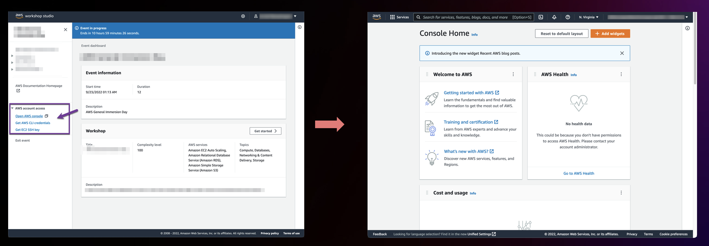

import Tabs from '@theme/Tabs';
import TabItem from '@theme/TabItem';

## Objective

This guide shows you how to setup the development environment to for the workshop.

<Tabs>
<TabItem value="AWS" label="At an AWS hosted event">

## Overview

If you are attending an AWS hosted event, you will have access to an AWS account with any optional pre-provisioned infrastructure and IAM policies needed to complete this workshop. The goal of this section is to help you access this AWS account. You may skip this section if you plan to use your own AWS account.

## Prerequisites

* Sign in via the one-click join event link provided by the event operator as part of an AWS hosted event.
* OR via the [Workshop Studio join URL](https://catalog.workshops.aws/join) with the 12 digit event access code distributed by an event operator.
* Carefully review the terms and conditions associated with this event.

## 1. Accessing AWS Account

After joining the event, you should see the page with event information and workshop details. You should also see a section titled **"AWS account access"** on the left navigation bar. You can use these options to access the temporary AWS account provided to you.

The **“Open AWS console”** link will open the AWS Management Console home page. This is the standard AWS Console that provides access to each service. Please note that the infrastructure associated with the workshop will be deployed to a specific region and can be only accessed from that region.



</TabItem>
<TabItem value="own" label="In your own AWS account (Cloud 9)" default>

:::warning
**In this workshop there will be a number of AWS resources created in your account. These resources will incur cost and will be billed to your AWS Account, make sure you delete all resources after the workshop to avoid unnecessary costs. Please refer to the cleanup section.**
:::

You can use the following setup to create a virtual development environment by using [AWS Cloud9](https://aws.amazon.com/cloud9/).

## 1. Deploying AWS CloudFormation template for Cloud9 instance and the workshop infrastructure

Go to [AWS CloudShell](https://console.aws.amazon.com/cloudshell/home#/) or navigate to AWS CloudShell in the AWS console.

:::info
If using the link above make sure the AWS console has opened in the region that you wish to run the labs in.
:::

Deploy AWS CloudFormation template

```bash showLineNumbers
curl https://raw.githubusercontent.com/aws-samples/java-on-aws/main/labs/unicorn-store/infrastructure/cfn/java-on-aws-workshop.yaml > java-on-aws-workshop.yaml
aws cloudformation deploy --stack-name java-on-aws-workshop \
    --template-file ./java-on-aws-workshop.yaml \
    --capabilities CAPABILITY_NAMED_IAM
```

Wait until the command finish successfully.

Go to [AWS CloudFormation](https://console.aws.amazon.com/cloudformation/home#/) or navigate to AWS CloudFormation in the AWS console

Check if the Stacks reached `CREATE_COMPLETE` status.

:::info
The creation of the stacks might take around 30 minutes.
:::


</TabItem>
</Tabs>

## 2. Accessing AWS Cloud9 Instance

Go to [AWS Cloud 9](https://console.aws.amazon.com/cloud9control/home#/) or navigate to Cloud9 in the AWS console:


Click on "Open" for the "java-on-aws-workshop" instance to connect to Cloud9 IDE:


When asked about "Working with Java?" - click "Activate" and refresh the entire browser page to activate the extension.


You have now successfully opened Cloud9 instance.

You can find the workshop code in the left sidebar to navigate through the files. You can close the welcome window and use `New terminal` command to open the terminal window and execute the commands in the workshop:


## 3. Additional hints

The AWS account will only be available for the duration of this workshop and you will not be able to retain access after the workshop is complete. However,
you can access the workshop instructions anytime after this event via [Java on AWS Immersion Day](https://catalog.workshops.aws/java-on-aws-immersion-day/en-US).

:::warning
AWS Cloud9 does not auto-save your files. Please ensure to save your files before deploying any changes via Ctrl+S or the top menu File&rarr;Save all.
:::

## Conclusion

Once you've verified access to the AWS account and AWS Cloud9 instance, you should have everything you need to get started with this workshop.
