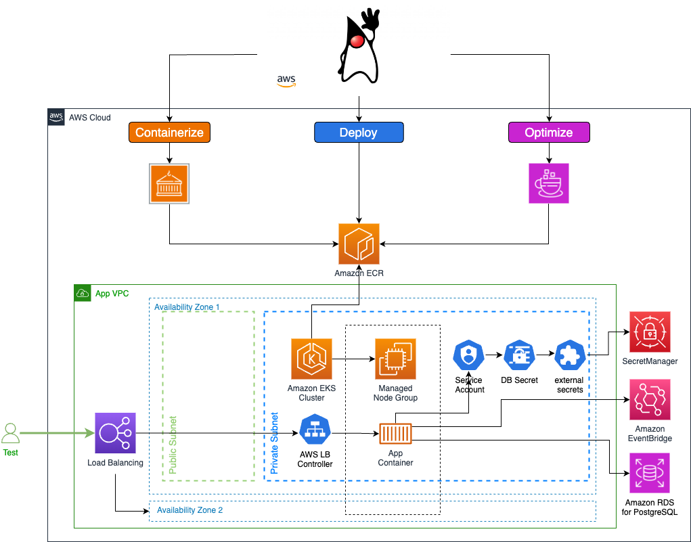

import Tabs from '@theme/Tabs';
import TabItem from '@theme/TabItem';

In this workshop, learn how to build cloud-native Java applications and deploy to Amazon Elastic Kubernetes Service (EKS) with best practices and performance-optimization techniques. Get hands-on experience using Amazon EKS, Amazon Corretto, Amazon ECR, GraalVM, Spring Boot, and more.

The workshop covers a variety of AWS services and tools and provides an introduction to Java related concepts. Below you can find a broad overview of services that are covered throughout the modules:



## [Introduction](java/introduction/workshop-setup.md)

- Setting up the Development Environment.
- Dive deep in UnicornStore Architecture.

## [Containerize and run](java/containers/build-image.md)

- Building container images with Java Application using Docker.
- Optimizing a Dockerfile with a multi-stage build.
- Pushing a container image to Amazon Elastic Container Registry (ECR).

## [Deploy to Amazon EKS](java/eks/eks-create.md)

- Create Amazon EKS cluster.
- Setup Amazon EKS for Java Application.
- Deploy a container image to Amazon EKS.

## [Optimize Container Images](java/optimizations/optimize-containers.md)

- Create Amazon EKS cluster.
- Setup Amazon EKS for Java Application.
- Deploy a container image to Amazon EKS.

---
## Know before you go

The following information will provide general guidance and safety-tips before running through the workshop.

## Target Audience

Developers, Architects, DevOps, SysOps, Testers. Anyone working with Java applications who is interested in using containers.

## Experience Required

Level: 200-300 (Intermediate to Advanced).

In this workshop you will be editing and changing Java source code. It would be helpful to be familiar with the Java programming language. If you are not, that's ok, please follow the instructions carefully.

You will also need a basic understanding of the AWS console and CLI.

## Cost

**If you run this workshop in your own AWS Account (without being provided an account at a hosted event) the resources that are created during this workshop will incur cost and will be billed to your account. Please make sure you delete all resources after the workshop to avoid unnecessary costs in the cleanup section.**

The workshop uses an Amazon RDS PostgreSQL database, it's cost in the eu-west-1 region is:
1 instance(s) x 0.078 USD hourly x (100 / 100 Utilized/Month) x 730 hours in a month = 56.9400 USD
Amazon RDS PostgreSQL instances cost (monthly): 56.94 USD

If you choose to use AWS Cloud9 as a development environment it will be charged at the [EC2 instance price](https://aws.amazon.com/cloud9/pricing/).

Depending on the deployment options that you chose you will be charged based on the [Amazon EKS](https://aws.amazon.com/eks/pricing/) pricing.

## Supported regions

If you run the workshop on your own, you can choose any AWS region. However, if you want to use AWS Cloud9 as a development
environment, you should check the [AWS Regional services list](https://aws.amazon.com/about-aws/global-infrastructure/regional-product-services/)
to see if it's available in the desired region.

At an AWS-managed event you can just follow the instructions of your facilitator who will preselect a region for you.

## Clean Up

<Tabs>
<TabItem value="own" label="In your own AWS account (Cloud 9)" default>

1. Execute the following commands to clean up your workshop environment:

```bash showLineNumbers
# approximately 60 minutes
~/environment/java-on-aws/labs/unicorn-store/infrastructure/scripts/99-destroy-all.sh
```

:::info
The deletion of the stacks might take more than 60 minutes.
:::

:::warning
If you created resources manually "Using UI (AWS Console)" you need to delete these resources manually
:::

Delete Cloud9 instance `CloudFormation` &rarr; `Stacks` &rarr; `java-on-aws-workshop` &rarr; `Delete`

</TabItem>
<TabItem value="AWS" label="At an AWS hosted event">

All the infrastructure components will be deleted automatically

</TabItem>
</Tabs>
