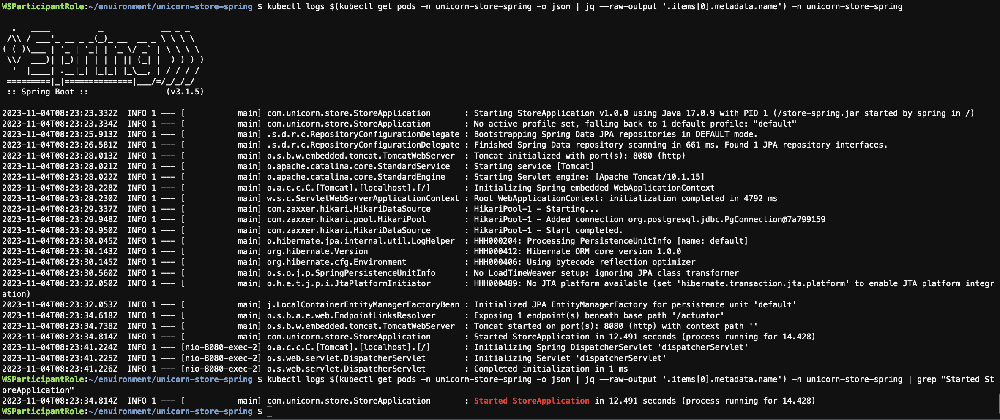

## Objective

In this chapter we are going to evaluate different performance optimizations. It is therefore essential to understand how the current application performs to measure the impact of the optimizations.

## Prerequisites

- [Deploy a container image to Amazon EKS](../../eks/java/deploy-app.md)

## 1. Getting the current image size

The first important factor you will investigate is the image size. The image size plays a key role in containerized environments as the image has to be initially downloaded and started by the container orchestration service.

Go to the [Amazon ECR](https://console.aws.amazon.com/ecr/home#/) console.

Check the current container image size:


As we can see, the current image size is around **380 MB**.

## 2. Accessing the application logs

To understand container startup times we'll investigate the application logs and retrieve the Spring application context startup as a reference.

Below you can find an example of the application startup time reported by Spring Boot in Amazon EKS:

```bash showLineNumbers
kubectl logs $(kubectl get pods -n unicorn-store-spring -o json | jq --raw-output '.items[0].metadata.name') -n unicorn-store-spring
kubectl logs $(kubectl get pods -n unicorn-store-spring -o json | jq --raw-output '.items[0].metadata.name') -n unicorn-store-spring | grep "Started StoreApplication"
```



As we can see, the current application startup time is around 12.5 seconds.

:::info
Image size and application startup times might be different in your case
:::

## Conclusion

In this section you have learned about the different factors that influence the application startup time and how to measure them. You learned how to access the application logs and identify the image size. In the next section you are going to apply the first optimization technique to accelerate Java application running on AWS container services.
