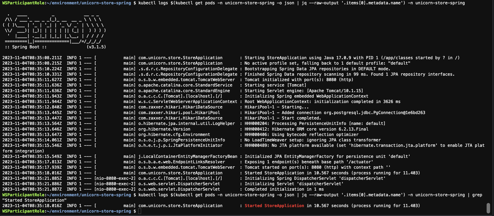

## Objective

In this section you'll inspect a simple and quick way to optimize [Open Container Initiative (OCI)](https://opencontainers.org/) images using [Jib](https://github.com/GoogleContainerTools/jib).

## Prerequisites

- [Preparation](../../optimizations/java/baseline.md)

## Context

The OCI currently contains three specifications: the Runtime Specification, the Image Specification and the Distribution Specification. Jib is a tool to build optimized OCI images without using a container runtime. It's available as a Maven or Gradle-plugin as well as a Java library. In our case we're going to use the Maven-plugin in order to create an optimized container image.

The important part for the build with Jib can be found in the `pom.xml`-file in the plugins section:

```xml showLineNumbers
<plugin>
    <groupId>com.google.cloud.tools</groupId>
    <artifactId>jib-maven-plugin</artifactId>
    <version>3.4.0</version>
    <configuration>
        <from><image>public.ecr.aws/docker/library/amazoncorretto:17.0.9-alpine3.18</image></from>
        <container>
            <user>1000</user>
        </container>
    </configuration>
</plugin>
```

The configuration at this point is very compact, we only define that the Java process in the container image does not run as root-user, but with a different user ID. We also use [Apline Linux](https://www.alpinelinux.org/) base image to achieve more improvements.

## 1. Changing the source code and pushing the image

You are now going to change the application code of `unicorn-store-spring/src/main/java/com/unicorn/store/controller/UnicornController.java ` to identify the new version of the application deployment.

Change the contents of the getWelcomeMessage function to identify the new version of the application:

:::info
AWS Cloud9 does not auto-save your files. Please ensure to save your files before deploying any changes via Ctrl+S or the top menu File&rarr;Save all.
:::

:::info
AWS Cloud9 does not auto-save your files. Please ensure to save your files before deploying any changes via Ctrl+S or the top menu File&rarr;Save all.
:::

Build new container images using `mvn compile jib:build`

```bash showLineNumbers
export ECR_URI=$(aws ecr describe-repositories --repository-names unicorn-store-spring | jq --raw-output '.repositories[0].repositoryUri')
aws ecr get-login-password --region $AWS_REGION | docker login --username AWS --password-stdin $ECR_URI
cd ~/environment/unicorn-store-spring
IMAGE_TAG=i$(date +%Y%m%d%H%M%S)
IMAGE_PATH=$ECR_URI:$IMAGE_TAG
mvn compile jib:build -Dimage=$IMAGE_PATH

IMAGE_PATH=$ECR_URI:latest
mvn compile jib:build -Dimage=$IMAGE_PATH
```

## 2. Re-deploying the application

After the new image has been pushed to ECR you can re-trigger the deployment of the application:

```bash showLineNumbers
kubectl rollout restart deploy unicorn-store-spring -n unicorn-store-spring
kubectl rollout status deployment unicorn-store-spring -n unicorn-store-spring
```

## 3. Testing the application

Run the following API call to verify that the new version of the application has been deployed successfully:

```bash showLineNumbers
export SVC_URL=http://$(kubectl get svc unicorn-store-spring -n unicorn-store-spring -o json | jq --raw-output '.status.loadBalancer.ingress[0].hostname')
curl --location --request GET $SVC_URL'/' --header 'Content-Type: application/json'; echo
```


## 4. Retrieving the results

1. Verify the new application image size in the [Amazon ECR](https://console.aws.amazon.com/ecr/home#/) console:


2. Retrieve the logs for the application as outlined in the previous section. Below you can find an example starting time after the optimization of the Amazon EKS deployment:

```bash showLineNumbers
kubectl logs $(kubectl get pods -n unicorn-store-spring -o json | jq --raw-output '.items[0].metadata.name') -n unicorn-store-spring
kubectl logs $(kubectl get pods -n unicorn-store-spring -o json | jq --raw-output '.items[0].metadata.name') -n unicorn-store-spring | grep "Started StoreApplication"
```



## Conclusion

As you can see, we were able to reduce the size of the container image from 380 MB to 212 MB which means approx. It is 45% reduction without any code changes by just using Jib and Linux Alpine base image to create the container image. The application startup time improved by approximately 2 seconds.
